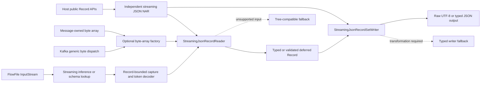

# Independent Streaming JSON Controller Services Bundle Plan

Status: implemented and component-validated; production-shaped acceptance pending

## Objective

Deliver two new, explicitly selectable NiFi Controller Services:

- `org.apache.nifi.serialization.json.streaming.StreamingJsonRecordReader`
- `org.apache.nifi.serialization.json.streaming.StreamingJsonRecordSetWriter`

The new pair must carry forward the complete reviewed JSON optimization: token-streaming inference, validated and deferred records, byte-backed serialized JSON, safe raw writing, compatible merged-schema writing, and Kafka direct-byte processing. They must also work through the standard Record Reader and Record Writer interfaces used by non-Kafka processors.

Existing flows using `JsonTreeReader` and `JsonRecordSetWriter` must retain their legacy behavior without automatically entering the new path.

Customer acceptance remains CPU-first:

- 162 Kafka partitions.
- About 2 KiB per JSON object.
- 182K average and 500K peak events/s.
- Infer Schema with Continue with Merged Schema.
- Existing nodes are near 95% CPU.

## Fixed architectural decisions

1. Package both services in a new independent `nifi-streaming-json-record-services-bundle`. The source bundle contains one host-neutral core, stock and enhanced reader adapters, and two mutually exclusive NAR build artifacts. It does not depend on `nifi-record-serialization-services`, `nifi-record-serialization-services-nar`, Kafka processor implementations, or benchmark modules.
2. Keep both services in one NAR because they share the parser, inference, deferred-record, UTF-8, schema-compatibility, and writer kernels. Separate reader and writer NARs would duplicate code and complicate classloading.
3. Use the private package root `org.apache.nifi.serialization.json.streaming`, not the existing `org.apache.nifi.json` package. This avoids a split package with the standard JSON NAR and keeps the bundle relocatable as a unit.
4. Register exactly the two new FQCNs in the bundle's own `META-INF/services/org.apache.nifi.controller.ControllerService`. Existing service registrations and manifests remain unchanged.
5. Implement both services from published NiFi Controller Service, Record, Schema Registry, and stable record-utility APIs. Do not subclass `JsonTreeReader`, `JsonRecordSetWriter`, `DateTimeTextRecordSetWriter`, or other implementation classes from the standard record-serialization NAR.
6. Restore `JsonTreeReader` and `JsonRecordSetWriter` to their legacy selection behavior. They do not silently select the byte-backed/deferred implementation.
7. Move the optimized parser, inference, record, schema-selection, and raw-writing kernels into the new bundle's private core. Shared means shared by both services and both host lanes, not shared through a sibling implementation NAR.
8. `StreamingJsonRecordReader` implements the normal `RecordReaderFactory` contract. The full-performance artifact also implements the additive host-owned `ByteArrayRecordReaderFactory` capability. `JsonTreeReader` does not implement it.
9. `StreamingJsonRecordSetWriter` implements the normal `RecordSetWriterFactory` contract. It accepts records from any reader, uses the raw path only when every safety gate passes, and otherwise performs normal typed serialization.
10. Kafka remains format-neutral. Its only optimized-reader knowledge is a generic host API byte-array capability and a generic record-lifetime contract.
11. Generic FlowFile processing must not require buffering a complete FlowFile. InputStream processing uses token streaming and, when raw output is useful, an owned record-sized capture rather than whole-content retention.
12. The new services are opt-in. There is no automatic migration of persisted legacy Controller Services to the new FQCNs.
13. Source portability and binary host compatibility are different promises. The bundle is independently buildable and movable; each released NAR targets an exact supported NiFi API and parent-NAR version.

## Two immutable oracles

The extraction has two independent comparison points:

| Oracle | Identity | Required result |
| --- | --- | --- |
| Legacy | Git revision `c4ca6c985b6a066edb1536a31b620ca02cea779b` | Restored `JsonTreeReader` and `JsonRecordSetWriter` match behavior, API, properties, and packaging |
| Optimized | Benchmark JAR SHA-256 `85145acf1e509e2adf4d4c2b3ec6f92b10190f2c713ef3bb9146ee60444494e5` | New streaming pair matches correctness and retains CPU/allocation performance |

Reference optimized measurements to preserve:

| Workload | Time/record | Allocation/record |
| --- | ---: | ---: |
| Composed validated infer/read/write | 2.253 us | 9,368 B |
| Kafka inferred stable | 5.882 us | 16,860 B |
| Kafka inferred drifting | 5.345 us | 21,599 B |
| Broker processor CPU, stable | 6.797 us | 22,704 B processor allocation |
| Broker processor CPU, drifting | 7.201 us | 23,320 B processor allocation |

The Kafka stable JMH reference includes the previously recorded host GC outlier. It remains the conservative comparison instead of selecting clean iterations.

## Component boundaries



### Bundle layout

Add a sibling extension bundle modeled on the existing independent Protobuf bundle:

```text
nifi-extension-bundles/
  nifi-streaming-json-record-services-bundle/
    pom.xml
    README.md
    nifi-streaming-json-record-services-core/
      pom.xml
      src/main/java/org/apache/nifi/serialization/json/streaming/
        AbstractStreamingJsonRecordReaderService.java
        StreamingJsonRecordSetWriter.java
        internal/...
      src/main/resources/docs/<writer-fqcn>/additionalDetails.md
      src/test/...
    nifi-streaming-json-record-services-stock/
      pom.xml
      src/main/java/org/apache/nifi/serialization/json/streaming/StreamingJsonRecordReader.java
      src/main/resources/META-INF/services/org.apache.nifi.controller.ControllerService
    nifi-streaming-json-record-services-enhanced/
      pom.xml
      src/main/java/org/apache/nifi/serialization/json/streaming/StreamingJsonRecordReader.java
      src/main/resources/META-INF/services/org.apache.nifi.controller.ControllerService
    nifi-streaming-json-record-services-stock-nar/
      pom.xml
      src/main/resources/META-INF/LICENSE
      src/main/resources/META-INF/NOTICE
    nifi-streaming-json-record-services-enhanced-nar/
      pom.xml
      src/main/resources/META-INF/LICENSE
      src/main/resources/META-INF/NOTICE
```

The core JAR owns the writer service and all host-neutral implementation. The adapter JARs contain the same final reader FQCN; the enhanced adapter alone links the additive byte-array and record-lifetime host APIs. Each adapter carries the provider file naming the adapter reader and core writer. The stock and enhanced Maven NAR artifacts publish the same canonical runtime NAR coordinate and must never be installed together. Tests and benchmarks may be separate modules or profiles, but cannot become NAR dependencies.

The standalone bundle parent imports the matching published NiFi BOM through `dependencyManagement`, pins the NiFi and NAR Maven Plugin versions, and does not inherit through a filesystem-relative parent. The NAR has exactly one NAR dependency: `nifi-standard-shared-nar` at the matching version. Java API dependencies are `provided` when supplied by the host or parent NAR. The dependency allowlist is limited to public Record, Record Serialization, Schema Registry, Controller Service, stable record utilities, and deliberately selected parser/compression APIs.

The production graph must not include:

- `nifi-record-serialization-services` or its NAR;
- `nifi-json-record-utils` or private sibling-NAR implementations unless a reviewed public API makes the dependency safe;
- any Kafka processor or Kafka client artifact;
- test fixtures, JMH, profilers, or benchmark harnesses;
- duplicate NiFi API, Jackson, SLF4J, or parent-NAR classes.

The NAR build generates `extension-manifest.xml`; it is inspected but not edited manually. The bundle README documents supported NiFi versions, installation, upgrade, rollback, the stock versus full-performance distinction, licenses, and source provenance.

### Public Controller Services

Both classes receive explicit `@Tags`, `@CapabilityDescription`, and `@SeeAlso` annotations. Annotation inheritance is not relied on. Both classes should be `final` unless an actual supported extension use case is identified. Service FQCNs and property identifiers become compatibility commitments after the first release.

Configuration descriptors match the established JSON services where behavior matches, but descriptor construction is bundle-owned. Copying a small amount of Controller Service wiring is preferable to coupling the portable NAR to standard implementation classes.

### Reader Controller Service

Use `StreamingJsonRecordReader extends SchemaRegistryService implements RecordReaderFactory`. In the full-performance host lane it also implements the host-owned `ByteArrayRecordReaderFactory` capability. It explicitly owns:

- established JSON reader property descriptors and migrations;
- schema-registry integration and schema-access selection;
- date/time configuration, parsing constraints, and starting-field configuration;
- lifecycle initialization for streaming inference;
- InputStream reader creation;
- direct byte-array reader creation;
- optimized-versus-fallback selection.

The service owns schema selection from bytes rather than requiring byte overloads on standard `SchemaAccessStrategy` or `RecordSourceFactory`. A `ByteArrayInputStream` wrapper is acceptable for strategies that only expose the standard stream API; it does not require copying the payload.

Prefer a small package-private reader-selection collaborator over embedding a large decision tree in the service class. Unsupported syntax, encoding, or schema cases use a bundle-owned correct typed fallback, not a standard-NAR implementation object.

### Writer Controller Service

Use `StreamingJsonRecordSetWriter extends SchemaRegistryRecordSetWriter implements RecordSetWriterFactory`, using the published `nifi-avro-record-utils` base already used by independent NiFi serialization bundles. It owns the established writer properties, validation, migration, output grouping, compression, schema header handling, MIME behavior, and date/time descriptor/lifecycle support. It does not inherit `DateTimeTextRecordSetWriter` from the standard implementation JAR.

Instantiate a bundle-private optimized result writer derived from the reviewed `WriteJsonResult` behavior. Preserve one generic JSON field-writing loop within the new bundle. The standard `JsonRecordSetWriter` and `WriteJsonResult` return to the legacy oracle and are not extension points for the new service.

### Shared optimized core

Move or reimplement the reviewed implementation under the new private package:

- `StreamingJsonSchemaInference`
- `JsonParserRecordSource`
- `StreamingJsonRowRecordReader`
- `ValidatedJsonRecordReader`
- `DeferredJsonRecord`
- `Utf8JsonValue`
- `JsonSchemaSelection`
- byte-array and InputStream parser sources;
- optimized JSON result writing;
- bundle-owned inference type accumulation and schema cache support.

Do not require the following implementation changes in the standard JSON bundle:

- byte overloads on `TokenParserFactory`, `RecordSourceFactory`, or `SchemaAccessStrategy`;
- streaming selection inside `JsonTreeReader`;
- raw byte/slice selection inside `JsonRecordSetWriter` or the standard `WriteJsonResult`;
- serialized-form enhancements in the standard `JsonTreeRowRecordReader`.

The unavoidable host-side surface for the full Kafka path remains deliberately small:

- `ByteArrayRecordReaderFactory` in `nifi-record-serialization-service-api`;
- `RecordReader.RecordHandlingMode`, or an equivalent public lifetime contract;
- format-neutral Kafka capability dispatch;
- audited generic Kafka grouping, lifecycle, cleanup, schema-merge, and retention fixes.

These types cannot be shipped privately inside the streaming NAR because Kafka and the Controller Service load through separate NAR classloaders. The host owns the shared contract. Keep audited Kafka changes generic; only the new reader opts into direct bytes.

## Portability and release contract

The independent source bundle supports two explicit host lanes from one core implementation:

| Lane | Host | Services | Reader entry | Guarantee |
| --- | --- | --- | --- | --- |
| Stock-compatible | An exact, unmodified supported NiFi release | Same two FQCNs | Standard `RecordReaderFactory` InputStream API | Portable correctness and tree-free streaming; bounded record ownership may add one payload-sized copy for Kafka |
| Full-performance | Exact NiFi build containing the generic byte and lifetime APIs | Same two FQCNs | Direct `byte[]` plus standard InputStream API | Complete audited zero-copy Kafka path and lifetime-aware grouping |

A class that directly implements `ByteArrayRecordReaderFactory` cannot load on a stock host where that API is absent. Therefore one binary NAR cannot promise both lanes. If stock-host support is required before the shared API lands in a released NiFi version, build two mutually exclusive NAR variants from the same source and private core. Only the thin reader host adapter differs; the two services, property identifiers, inference, decoder, records, and writer remain shared.

The normal release model after the generic API is published is one NAR per supported NiFi minor version, with that released API version declared as the minimum. Before then, artifact names and compatibility metadata must distinguish stock and full-performance variants. They must never be installed together.

Moving the bundle outside this repository must require no Java source changes; selecting a target is limited to version properties and published coordinates. The extracted build must include a standalone parent POM, Maven Wrapper, exact NiFi/BOM/NAR-plugin versions, Java 21 toolchain, README, LICENSE, NOTICE, source provenance, SBOM, checksums, and CI. It must not inherit through a filesystem-relative path into the NiFi checkout or rely on reactor-only artifacts.

The standalone release is rebuilt and tested for each claimed NiFi version. Binary compatibility is not inferred from the phrase “NiFi 2.x.”

## Reader execution contract

| Input and schema mode | Planned reader path | Ownership and lifetime | Handling mode |
| --- | --- | --- | --- |
| Direct `byte[]`, strict UTF-8, direct inference | Streaming inference once; reuse validated offsets; zero-copy deferred records | Caller array retained; caller must not mutate while records live | `FULLY_VALIDATED` only after materialization safety is proved |
| Direct `byte[]`, static/cached/registry schema | One-pass streaming typed read with reusable byte slices when safe | Caller array retained | `RETAINABLE` |
| InputStream, direct inference | Streaming inference using mark/reset; second pass captures one record at a time; deferred record owns its copied bytes | One owned byte array per returned record; no whole-FlowFile buffer | `FULLY_VALIDATED` only when no later checked failure is possible; otherwise `RETAINABLE` |
| InputStream, static/cached/registry schema | One-pass eager token decoding; attach an owned record slice only when exact safe capture is available | Typed record and optional owned slice survive reader close | `RETAINABLE` |
| Lenient syntax, content schema reference, non-UTF-8, unsupported type/depth, incompatible nested selection | Explicit tree or typed compatibility fallback | Existing behavior | Mode of fallback reader |

Do not report `FULLY_VALIDATED` merely because JSON syntax was scanned. Schema conversion and deferred materialization must also be unable to introduce a later checked failure.

### Record-bounded InputStream capture

Refactor the byte-only streaming row reader around one token decoder and two input implementations:

- byte-array input exposes zero-copy `Utf8JsonValue` slices;
- capturing stream input tracks absolute byte positions and owns the bytes read for the current record, including parser read-ahead.

At each completed logical record, copy only the exact record range into an owned array, retain any read-ahead suffix needed for the next record, and discard consumed prefixes. Returned records must never reference Jackson buffers or a mutable capture ring. Root arrays, JSONL, whitespace, nested fields, and multibyte UTF-8 boundaries require explicit slice tests.

The maximum retained unit is one logical record plus bounded parser read-ahead, not the whole FlowFile. Processors that retain many records can still retain their total record bytes by design; that cost is measured separately.

If record-bounded capture does not beat eager streaming for transformed workloads, the service chooses eager typed records for those paths. The default is selected from paired benchmarks, not assumption. No user-facing tuning property is introduced until measurements show a stable, understandable choice that cannot be made automatically.

## Writer execution contract

The streaming writer may use raw JSON only when all relevant conditions hold:

- serialized MIME type is JSON;
- bytes are valid reusable UTF-8 JSON;
- the record has not been directly or transitively mutated;
- pretty-print state matches;
- scientific-notation policy matches;
- timestamp representation and configured formats allow passthrough;
- null suppression does not require a conflicting transformation;
- schemas are exactly equal, or the audited narrow compatible-widening rule applies;
- missing fields are nullable, have no default, and can be safely injected or suppressed;
- aliases, dropped unknown fields, duplicate fields, nested evolution, defaults, and incompatible coercions do not leak stale source bytes.

Otherwise the writer performs ordinary typed serialization. Compression, framing, schema headers, result attributes, MIME type, flush, finish, and close behavior stay common to both paths.

Pairing is not required:

| Pair | Required behavior |
| --- | --- |
| Legacy reader + legacy writer | Exact legacy oracle |
| Legacy reader + streaming writer | Correct output; String raw optimization only when safe |
| Streaming reader + legacy writer | Correct typed fallback; no byte/deferred behavior leaks into legacy writer |
| Streaming reader + streaming writer | Complete optimized path |
| Streaming reader + non-JSON writer | Transparent materialization and standard Record behavior |
| Non-JSON reader + streaming writer | Standard typed JSON output |

## Processor coverage

The services work anywhere the normal factory interfaces are accepted. Tests cover representative contract categories rather than adding JSON branches to every processor.

| Processor or category | Contract exercised |
| --- | --- |
| `ConvertRecord` | InputStream pass-through, all four old/new pairings, raw output eligibility |
| `QueryRecord` | Field access, materialization, projection, changed schema |
| `UpdateRecord` | Direct and nested mutation, serialized-form invalidation |
| `PartitionRecord` | Record retention, grouping, multiple writers, lifetime after reader advancement |
| `MergeRecord` | Multi-FlowFile retention and merged schemas |
| `SplitRecord` | Root arrays, JSONL, record boundaries, writer lifecycle |
| `ValidateRecord` | Schema validation and malformed-record routing |
| `ReaderLookup` and `RecordSetWriterLookup` | Indirect service selection |
| Kafka producer record conversion | Generic InputStream path |
| Kafka consumer record conversion | Direct-byte zero-copy path, grouping, offsets, failures |

After core service acceptance, adopt the optional byte-array dispatch in processors that already own immutable payload bytes. Centralize the `instanceof ByteArrayRecordReaderFactory` dispatch in one small utility rather than copying it across bundles. Candidate call sites, handled in separate changesets, include:

- `ConsumeMQTT`
- `ConsumeAzureEventHub`
- GCP Pub/Sub consumer conversion
- `ConsumeKinesis` and its record processor
- JMS record conversion
- `ListenUDPRecord`
- Kafka key wrapper reading

Each adoption is independently optional. The new Controller Services function through InputStream before those processor-specific accelerations are added.

## Phased implementation

## Phase 1: Freeze both oracles and the current change inventory

- Rebuild the legacy revision and optimized artifact in isolated Maven/output directories.
- Snapshot public signatures and implemented interfaces.
- Snapshot every legacy reader/writer descriptor: name, display name, default, requirement, allowable values, dependencies, EL scope, and migration behavior.
- Preserve schemas, records, serialized bytes, exception types, failure timing, offsets, attributes, writer metadata, close behavior, service registration, and NAR contents.
- Classify the current patch into new-service-only logic, additive shared APIs, generic correctness fixes, generic Kafka improvements, and behavior currently leaking into legacy services.
- Preserve all raw benchmark results and environment metadata under artifact-hash/iteration names.
- Replace benchmark-only service subclasses with explicit mode assertions before using benchmarks as gates.

Verification:

- Both oracles build reproducibly.
- Baseline fixtures are immutable.
- Benchmark tests assert exact service class, byte/InputStream entry point, handling mode, inference implementation, and writer strategy.

## Phase 2: Restore and lock legacy services

- Restore `JsonTreeReader` to legacy tree inference and InputStream/tree record creation.
- Restore legacy `JsonRecordSetWriter` selection and legacy `WriteJsonResult` constructors.
- Keep YAML, JsonPath, anonymous subclasses, and protected factory/source hooks on their original paths.
- Retain only shared refactors that are differentially identical for every existing format; otherwise isolate them behind the new service.
- Add snapshot and downstream-source tests for properties, migrations, inheritance, Mockito-style method calls, and serialized flows.

Verification:

- Differential reader and writer matrix against `c4ca6c985b6a066edb1536a31b620ca02cea779b`.
- Existing JSON, YAML, XML, and JsonPath suites.
- `japicmp` binary/source checks and compiled downstream subclass fixtures.
- Legacy Kafka selection proves the InputStream method is used even when Kafka owns bytes.
- Legacy CPU no more than 5% above baseline and allocation no more than 2% above baseline after paired reruns.

## Phase 3: Package the two new Controller Services

- Create `nifi-streaming-json-record-services-bundle` with host-neutral core, stock/enhanced adapters, and stock/enhanced NAR modules.
- Add the two final service classes, explicit annotations, service-provider entries, and documentation under the private package root.
- Reproduce compatible configuration through public APIs and small bundle-owned helpers; do not extend or depend on the standard JSON service implementations.
- Move the shared optimized kernels into the bundle and remove new-service coupling from the legacy implementation modules.
- Add the bundle to `nifi-extension-bundles/pom.xml` and its NAR to `nifi-assembly/pom.xml`. Add it to MiNiFi assembly only after the same compatibility suite passes there.
- Verify lifecycle initialization runs exactly once.
- Make service selection observable to tests without adding per-record production counters or atomics.
- Build both lanes independently and inspect every JAR, NAR, dependency tree, class origin, and generated extension metadata. Prove the core constant pool has no enhanced-only API references.

Verification:

- The independent NAR exposes exactly two services. The installed NiFi distribution exposes those two plus the unchanged standard JSON services without duplicate providers or packages.
- Both new services can be created, configured, enabled, referenced, disabled, deleted, and recreated.
- Saved flows containing old and new services survive export/import and restart.
- `ReaderLookup` and `RecordSetWriterLookup` can select the new pair.
- No benchmark or test dependency enters the production JAR/NAR.
- No implementation dependency on the standard JSON NAR or Kafka enters the production graph.
- Copying the bundle to a clean directory and resolving only published target artifacts passes `clean verify`.
- A clean temporary Maven repository and a dependency-prefetched offline rebuild both pass.
- `jdeps` and duplicate-class scans show no imports from prohibited implementation packages and no bundled copies of host API, Jackson, logging, or parent-NAR classes.
- The install archive contains exactly one matching NAR plus README, LICENSE, NOTICE, SBOM, checksums, and compatibility metadata.
- Removing the new NAR cleanly restores the host without replacing or editing any stock JAR.

## Phase 4: Move the direct-byte reader into the new service

- Move streaming inference, validated offsets, deferred records, UTF-8 slices, eager streaming fallback, and exact optimized selection into `StreamingJsonRecordReader`.
- Preserve direct and cached inference, static/registry schemas, content references, starting fields, schema application, parsing strategies, encodings, duplicate normalization, constraints, and unsupported-schema fallback.
- Preserve the 1,024-record metadata bound and shared source-array identity for byte-array root arrays.
- Prove array immutability and record validity after reader advancement and close.

Verification:

- Differential schemas and values against both oracles and an independent Jackson semantic oracle.
- Root object, arrays, JSONL, nested fields, more than 1,024 records, duplicate keys at every depth, depth 100/101, Unicode, BOMs, UTF-16/32, malformed tails, numeric and temporal boundaries, null/missing/default/alias behavior, and hostile schema cardinality.
- Direct mutation and nested mutation invalidate raw forms.
- New service reproduces the optimized composed and Kafka byte-path performance before further refactoring.

## Phase 5: Move enhanced JSON writing into the new service

- Introduce the internal legacy-versus-streaming serialized strategy.
- Keep the generic field writer, framing, compression, schema headers, and lifecycle shared.
- Move UTF-8 byte/slice output and compatible merged-schema null injection behind `StreamingJsonRecordSetWriter`.
- Keep the compatibility cache bounded and recursive schemas identity-safe.

Verification:

- String, byte array, UTF-8 slice, and generic typed records.
- Exact/equal/compatible/incompatible/recursive schemas.
- Missing nullable fields, null suppression, defaults, aliases, numeric widening, nested evolution, mutations, unknown-field dropping, and duplicates.
- Array and JSONL framing, pretty print, scientific notation, timestamp modes, every compression format, schema attributes, MIME type, begin/finish/flush/close, and injected failures.
- Eligible results are byte-identical to the optimized oracle; every fallback is semantically equal to typed legacy output.

## Phase 6: Add processor-independent InputStream streaming

- Separate token decoding from byte-array ownership.
- Implement tree-free eager InputStream decoding with the same conversion core.
- Use the NiFi ContentClaim stream mark/reset contract for streaming inference followed by reading.
- Implement record-bounded capture for deferred/raw pass-through without whole-FlowFile buffering.
- Keep parser read-ahead, absolute offsets, slice ownership, and cleanup explicit.
- Select eager versus deferred behavior from paired pass-through and transformation measurements.
- Use explicit tree/typed fallback when exact semantics cannot be guaranteed.

Verification:

- Known and unknown input lengths; mark-capable and ordinary streams; short reads; incorrect length hints; empty input; close ownership.
- Record boundaries across arrays, JSONL, whitespace, nested fields, multibyte UTF-8, read-ahead, and large individual records.
- Retained records remain valid after advancing and closing the reader.
- No captured record references a moving parser buffer.
- JFR shows no `JsonNode` construction on supported InputStream paths and no whole-FlowFile allocation.
- Retained heap is bounded by retained logical records plus parser buffers.

## Phase 7: Cross-processor compatibility

- Add the new services to representative standard processor tests.
- Exercise pass-through, field access, mutation, retention/grouping, merge/split, validation, lookup, and non-JSON writer behavior.
- Compile every affected module referencing the public reader/writer factory APIs.
- Verify old and new services in the same processor matrix.

Verification:

- Correct relationships, values, schemas, attributes, record counts, provenance counts, and writer results.
- Reader closure never invalidates a retained record.
- Transformed or mutated processors never emit stale source bytes.
- All affected processor reactors pass after each changeset.

## Phase 8: Kafka and other byte-owning processors

- Keep Kafka direct-byte dispatch generic and make the new reader the only JSON service in the target distribution that opts into it.
- Preserve audited grouping, schema-shape, failure, offset, rollback, replay, rebalance, ordering, retention, and cleanup behavior.
- Add a shared optional-byte dispatch helper only after the core services pass.
- Adopt that helper in byte-owning processors one bundle at a time, with no acknowledgment or routing changes.

Kafka verification matrix:

- `USE_VALUE`, `INJECT_OFFSET`, `USE_WRAPPER`, and `INJECT_METADATA`.
- Key and value readers.
- Create-new and merged-schema grouping.
- Infer, cache, static, registry, and content-reference schemas.
- Stable, alternating, recursive, and more-than-64-shape inputs.
- Root object, array, JSONL, empty input, null value, and multi-record values.
- Checked failures at first/middle/final records; runtime writer start/write/finish/close failures.
- Session rollback, replay, rebalance, partition ordering, offsets, headers, timestamps, concurrent tasks, and provenance.

## Phase 9: Performance and resource iteration

Use the actual production Controller Services in all measurements.

Benchmark matrix:

- legacy pair;
- optimized oracle pair;
- new streaming pair;
- both mixed old/new pairings;
- direct byte array, InputStream eager, and InputStream captured/deferred;
- 256 B, 2 KiB, 16 KiB, large objects, arrays, and JSONL;
- infer stable, infer drifting, cached, static, and content-reference schemas;
- raw eligible, materialized, mutated, transformed, and fallback records;
- null-heavy and scientific-notation cases;
- one thread and production-representative concurrency.

Measurements:

- processor-thread CPU/record as the primary metric;
- records/core and wall throughput;
- allocated bytes/record, GC count/time/CPU, safepoints, and tail latency;
- JFR CPU and allocation profiles;
- JOL independent-message and shared-array retained graphs;
- heap-dump dominators after reader/group close;
- live-heap plateau, RSS, and Native Memory Tracking;
- lock/concurrency profiles;
- validation-run counts for direct/deferred/eager/tree and raw/typed paths.

Benchmark discipline:

- unique artifact hash and iteration for every build;
- no concurrent Maven, Docker, or benchmark process;
- identical JVM, GC, host, fork, warmup, corpus, and processor controls;
- paired runs and repeated complete matrices;
- validation outside timed intervals;
- retain and explain outliers; never select only clean iterations.

Acceptance:

- The full-performance NAR's direct-byte composed and Kafka paths stay within 5% CPU/time and 2% allocation of optimized artifact `85145acf1e50...`.
- The stock-compatible NAR is reported separately. It must preserve correctness, stay tree-free on supported inputs, and quantify its bounded-copy cost; it does not claim zero-copy Kafka allocation parity.
- The new pair retains at least 2x records/core or at most 50% legacy processor CPU/record for the customer inferred/merged workload.
- Restored legacy services stay within 5% CPU/time and 2% allocation of the legacy oracle.
- No increase in peak live heap, post-close retained heap, RSS plateau, GC CPU, or tail pauses at equal workload and concurrency.
- Any unexplained regression blocks the phase.

## Phase 10: Independent review loops

Run independent reviews after legacy extraction, after each new Controller Service, after InputStream support, after Kafka integration, and after final performance work:

1. public/source compatibility and Controller Service/NAR packaging;
2. JSON correctness, malformed input, lifecycle, retention, and concurrency;
3. CPU/allocation/JFR hot paths and benchmark fidelity;
4. code reuse, API minimization, duplication, and simplification;
5. security and resource bounds, including parser limits, schema cardinality, memory retention, raw JSON validation, and denial-of-service cases.

Review gate:

- Each finding includes file/function, severity, and reproduction evidence.
- Address every actionable compatibility, correctness, lifecycle, and security finding.
- Re-review every fix independently.
- Run affected tests after every changeset.
- Re-run differential compatibility and paired performance after reuse or simplification changes.
- No phase closes with an unresolved correctness/compatibility finding or unexplained performance change.
- Do not add abstractions solely to remove harmless Controller Service wiring duplication.

## Phase 11: Full repository and production acceptance

Repository gate:

- Focused utility, API, service, Kafka, and processor tests.
- Independent streaming JSON bundle reactor from the NiFi tree and from a clean extracted directory.
- Full record-serialization reactor to prove the restored legacy services remain unchanged.
- Full Kafka reactor and broker integration.
- Full standard-processors source-compatibility reactor.
- Benchmark profile/package reactor.
- Streaming services JAR and NAR build, RAT, license, provider, generated-manifest, dependency-convergence, `jdeps`, duplicate-class, SBOM, and reproducibility inspection.
- NAR classloader tests with the standard record-serialization NAR installed simultaneously; standard and streaming classes must resolve from their own code sources and shared APIs from the host/parent loader.
- Stock-compatible NAR installation on an untouched binary NiFi distribution, when that lane is released.
- Full-performance NAR installation on its exact matching host distribution, plus zero-copy spy coverage.
- Seven affected existing public JARs, plus any newly changed public artifact, pass `japicmp` against the legacy revision.
- Root affected build, formatting, and `git diff --check` pass.
- Final reports contain exact artifact hashes, commands, environment, and raw result paths.

Production-shaped gate:

- Real NiFi with durable FlowFile/content repositories and provenance.
- Real Kafka with 162 partitions.
- 182K average and 500K peak events/s.
- Representative 2 KiB data, actual schema cardinality, merged-schema grouping, concurrent tasks, queues, and backpressure.
- Side-by-side old/new output validation before timing.
- CPU/core, processor CPU/record, records/core, allocation, GC CPU, live heap, RSS, JFR, repository latency, and tail pauses.
- Steady-state and soak runs, restart, rebalance, replay, and backpressure recovery.

Final acceptance:

- Exact value, schema, attribute, grouping, and failure equivalence.
- No unexpected loss, duplication, offset gap, or stale serialized data.
- No memory growth after queues drain and groups close.
- At least 2x records/core or at most 50% legacy CPU/record at equal customer workload.
- Existing flows using `JsonTreeReader` and `JsonRecordSetWriter` require no changes and retain legacy behavior.
- A clean host installation requires only the matching independent NAR or signed install archive; no standard NAR replacement is allowed.
- Each published artifact names the exact compatible NiFi version and full-performance versus stock lane.
- The final source tree builds outside the NiFi checkout using published immutable dependencies, with no absolute path, reactor-only dependency, or `SNAPSHOT` in a release.

## Iteration and reporting protocol

Every implementation iteration follows this loop:

1. research and profile the current limiting path;
2. design the smallest vertical slice;
3. implement production code and focused regressions;
4. run affected tests immediately;
5. run correctness/differential tests;
6. rebuild an independently identified benchmark artifact;
7. run CPU, allocation, and memory measurements;
8. dispatch independent compatibility, correctness, performance, and reuse/simplification reviews;
9. address findings;
10. rerun the same correctness, compatibility, and performance gates;
11. update the Obsidian implementation report with decisions, rejected alternatives, artifact hashes, commands, and raw evidence.

No performance result is accepted if its benchmark mode does not instantiate the actual production Controller Service or if a concurrent build/process contaminated the run.
